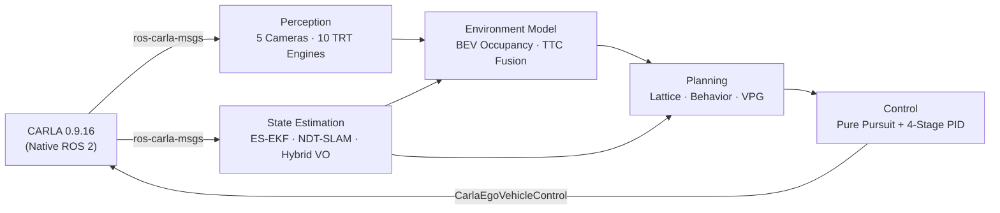

# Autonomous Driving Stack V6.1


-FF9900?logo=amazon-aws&logoColor=white)

A closed-loop, modular autonomous driving pipeline deployed in CARLA simulation. This architecture integrates multi-camera TensorRT perception, PCL NDT-SLAM, a 12-state Error-State Kalman Filter (ES-EKF) with Non-Holonomic Constraints (NHC), Frenet-frame lattice planning, and decoupled Pure Pursuit/PID control across **9 domain-separated ROS 2 packages**.

**V6 Architecture Update:** Eliminates external bridge layers by adopting native ROS 2 DDS communication via `ros-carla-msgs` directly within the CARLA client node. Sensor publishing runs synchronously across distinct physical cadences (100 Hz IMU, 50 Hz Wheel/Mag, 30 Hz Vision, 10 Hz LiDAR, 1 Hz Dual GNSS).

> **Deployment Status:** Deployed and running closed-loop navigation in CARLA simulation.
> 
> 

> **Companion Repositories:**
> * [`Perception Pipeline V2`](https://github.com/Udit0034/perception-pipeline-v2) — Standalone multi-camera TensorRT validation harness
> * [`LiDAR Perception Pipeline`](https://github.com/Udit0034/lidar-perception-pipeline) — RangeNet++ and PointPillars LiDAR perception node
> 
> 

---

## Contents

* [Architecture](#architecture)
* [Sensor Cadence & Synchronous Topology](#sensor-cadence--synchronous-topology)
* [Metrics](#metrics)
* [Repository Layout](#repository-layout)
* [Getting Started](#getting-started)
* [Evaluation & Benchmarking](#evaluation--benchmarking)
* [Known Limitations](#known-limitations)
* [Future Work](#future-work)

---

## Architecture



* **Perception** — 5-camera synchronized topology (front stereo pair, rear, side left, side right). TensorRT FP16 engines execute StereoNet depth, 3× monocular depth, 4× semantic segmentation, YOLOv8 object detection, and traffic-sign classification.


* **State Estimation** — 13-state nominal / 12-state error manifold ES-EKF fusing high-rate IMU, 1 Hz Dual-GNSS baseline yaw and 3D position, event-driven wheel odometry, calibrated magnetometer heading, and kinematic Non-Holonomic Constraints ($v_{\text{lat}} = 0, v_{\text{up}} = 0$).
* **SLAM & Visual Odometry** — 3D PCL NDT-SLAM with semantic BEV dynamic obstacle masking and pose-blending initial guesses. Hybrid RGB-D visual odometry leveraging sparse LiDAR-to-camera depth projections, GFTT/FAST corners, Forward-Backward LK optical flow, EPnP with RANSAC, and speed-constrained translation scaling.
* **Planning** — Global topological mission planner, quintic polynomial lattice trajectory sampling in the Frenet frame with hard LiDAR obstacle pruning, curvature-dependent behavioral state logic, and dynamic Time-To-Collision (TTC) Velocity Profile Generation (VPG).


* **Control** — Pure Pursuit lateral controller configured on the 2.875 m vehicle wheelbase with left-handed/right-handed frame translation, paired with a 4-stage longitudinal PID controller featuring feed-forward acceleration and jerk slew-rate limiting.

---

### Sensor Cadence & Synchronous Topology

The stack operates across synchronous sensor rates managed by `carla_node_native.py`:

| Sensor | Update Rate | Frame / Topic | Description |
| --- | --- | --- | --- |
| **IMU** | **100 Hz** | `/carla/hero/imu` | Strapdown linear acceleration & angular velocities for ES-EKF state propagation. |
| **Ground Truth Odometry** | **100 Hz** | `/carla/hero/odometry` | Native simulation ground truth used for evaluation alignment. |
| **Magnetometer** | **50 Hz** | `/carla/hero/magnetometer` | Calibrated magnetic compass heading. |
| **Wheel Odometry** | **50 Hz** | `/carla/hero/wheel_odom` | Forward longitudinal velocity ($v_x$) + steering angle ($\delta$). |
| **Altimeter** | **50 Hz** | `/carla/altimeter` | Barometric/altitude measurement for vertical drift damping. |
| **RGB Cameras (×5)** | **30 Hz** | `/carla/hero/<cam>/image` | Raw camera streams (Front L/R 720p, Rear/Sides 400p). |
| **LiDAR (Raycast)** | **10 Hz** | `/carla/hero/lidar_top/point_cloud` | 28 channels, 100k pts/sec, 150 m range for NDT-SLAM and VO depth fusion. |
| **Dual GNSS** | **1 Hz** | `/carla/hero/gnss_front`, `rear` | Dual antenna array producing 3D position and ENU baseline heading. |

---

### Metrics

Benchmark evaluated over a continuous **172.6-second**, **1.37 km** closed-loop autonomous run in CARLA Town01 on an **AWS G4dn instance (NVIDIA T4)** running the complete stack alongside the simulator.

#### State Estimation & Localization Performance

All values computed against CARLA ground-truth odometry:

| Metric | Measured Value | Operational Context |
| --- | --- | --- |
| **Duration / Samples** | **172.57 s / 17,157 samples** | Full closed-loop urban evaluation route. |
| **3D Position RMSE** | **0.276 m (27.6 cm)** | Fused ES-EKF trajectory error. |
| **X / Y / Z RMSE** | **0.215 m / 0.164 m / 0.055 m** | Decoupled Cartesian position errors. |
| **Mean / Max 3D Error** | **0.228 m / 1.142 m** | Stable sub-meter tracking envelope. |
| **Yaw RMSE** | **0.136°** | Global heading tracking accuracy. |
| **Pitch / Roll RMSE** | **0.031° / 0.134°** | Angular orientation tracking errors. |
| **Corner 3D Position RMSE** | **0.506 m** | Isolated at turns where $\lvert\dot{\psi}\rvert \ge 3.5^\circ/\text{s}$. |
| **Corner Yaw RMSE** | **0.384°** | Heading error under lateral turning dynamics. |
| **Average Closed-Loop Speed** | **7.93 m/s (~28.5 km/h)** | Urban speed tracking. |
| **NDT-SLAM 3D RMSE** | **9.314 m** | Real-time map registration without loop closure. |
| **Visual Odometry 3D RMSE** | **136.109 m** | Pure open-loop dead-reckoning (~9.9% scale drift over 1.37 km). |

#### Perception (TensorRT FP16 Engines)

Evaluated across four primary perspective cameras (`front_right` serves exclusively as the passive baseline for StereoNet disparity):

| Camera Position | Evaluated Modality | Range Cap | mIoU | Depth RMSE | $\delta < 1.25$ |
| --- | --- | --- | --- | --- | --- |
| **Front Left** | StereoNet Depth + Segmentation | 250 m | **0.586** | 10.50 m | 84.2% |
| **Rear** | MonoDepth + Segmentation | 150 m | **0.612** | 1.49 m | 91.5% |
| **Side Left** | MonoDepth + Segmentation | 80 m | **0.702** | 0.78 m | 95.1% |
| **Side Right** | MonoDepth + Segmentation | 80 m | **0.698** | 0.81 m | 94.8% |

---

## Repository Layout

```text
autonomous-driving-stack-v6/
├── eval_plots/                     # Generated trajectory plots and ekf_metrics.json
├── maps/                           # Persistent PCD maps for NDT-SLAM (hero_map.pcd)
├── requirements.txt
├── src/
│   ├── autonomy_stack/             # Master launch orchestrator (main.launch.py) & RViz configs
│   ├── autonomy_perception/        # Python: CARLA native node, TRT inference, dashboard
│   ├── autonomy_perception_cpp/    # C++: LiDAR/Semantic occupancy grids, lane-centering, TTC
│   ├── autonomy_localization/      # Launch & configuration files for state estimation
│   ├── autonomy_localization_cpp/  # C++: ES-EKF, PCL NDT-SLAM, LiDAR-fused Visual Odometry
│   ├── autonomy_planning/          # Python: Mission planner, Velocity Profile Generation (VPG)
│   ├── autonomy_planning_cpp/      # C++: Frenet lattice trajectory planner, behavior states
│   ├── autonomy_control_cpp/       # C++: Pure Pursuit lateral + 4-stage longitudinal PID
│   ├── autonomy_evaluation/        # Python: evaluate_node.py & metric_viz.py
│   └── ros-carla-msgs/             # Native ROS 2 interface definitions for CARLA
└── LICENSE

```

---

## Getting Started

### Prerequisites

* **Ubuntu 22.04 LTS**
* **ROS 2 Humble**
* **CARLA 0.9.16** (Native DDS setup)
* **CUDA 12.x / TensorRT 8.6+**
* **PCL 1.12+ / OpenCV 4.x / Eigen 3.4+**

### 1. Workspace Setup

```bash
git clone https://github.com/Udit0034/autonomous-driving-stack-v6.git
cd autonomous-driving-stack-v6
python3 -m venv venv
source venv/bin/activate
pip install -r requirements.txt

```

### 2. Build Workspace

Run `colcon build` outside the Python virtual environment:

```bash
deactivate
source /opt/ros/humble/setup.bash
rosdep install --from-paths src --ignore-src -r -y
colcon build --symlink-install --cmake-args -DCMAKE_BUILD_TYPE=Release
source install/setup.bash

```

### 3. Launch Stack

```bash
# Build TensorRT engine cache (required on first run)
source venv/bin/activate
ros2 run autonomy_perception engine_builder_node

# Launch master stack
source install/setup.bash && source venv/bin/activate
ros2 launch autonomy_stack main.launch.py with_rviz:=true debug:=false

```

---

## Evaluation & Benchmarking

When `Ctrl+C` is pressed, `evaluate_node.py` dumps synchronized telemetry logs and synchronously spawns `metric_viz.py`:

```bash
# Generate plots and metrics manually from an existing run log
python3 src/autonomy_evaluation/autonomy_evaluation/metric_viz.py \
  --run-dir eval_temp \
  --debug

```

Metrics and trajectory comparison figures will be exported directly into `eval_plots/ekf_metrics.json` and `eval_plots/*.png`.

---

## Known Limitations

* **Single-GPU Resource Contention:** CARLA rendering and 10 TensorRT engines share a single NVIDIA T4 GPU, capping perception throughput to ~11 FPS. The control loop runs independently at 50 Hz.
* **Static Environment Assumption:** The Frenet lattice planner treats non-ego entities as static costmap obstacles; dynamic multi-agent trajectory prediction is not active in V6.
* **Numerical Jerk Calculation:** Longitudinal jerk in `metric_viz.py` is calculated via double numerical differentiation over discrete simulator steps, creating artificial derivative spikes. Actual actuator jerk is physically bounded by the controller to $2.5.

---

## Future Work

### V6.1 Roadmap

* **NDT-SLAM Parameter Optimization:** Optimize voxel leaf sizes, step sizes, and keyframe intervals to reduce scan-matching error and tighten drift bounds.
* **Visual Odometry Enhancements:** Upgrade visual feature handling and scale constraints based on our [`Vision-LiDAR-Odometry-Benchmark`](https://github.com/Udit0034/visual-lidar-odometry-benchmark) findings.
* **Realistic Sensor Noise Profiles:** Transition from default noise-free CARLA sensor parameters to realistic Gaussian noise, bias walk, and wheel slip profiles, followed by re-tuning EKF covariance matrices for field robustness.
* **Degraded Condition Fault-Tolerance:** Evaluate stack robustness under edge-case conditions (GNSS denial, camera lens occlusion, fog/rain, sensor dropouts) and deploy automatic safety fallback modes.
* **Analytical Jerk Filtering:** Upgrade the evaluation node to calculate passenger comfort metrics from filtered accelerometer telemetry rather than discrete derivative steps.

### V7 Roadmap (Dynamic Environment Architecture)

* **Multi-Modal LiDAR Perception:** Integrate PointPillars / RangeNet++ directly into the tracking pipeline and migrate compute deployment from AWS T4 (G4dn) to NVIDIA L4 (G6).
* **Dynamic Multi-Agent Forecasting:** Implement 3D obstacle bounding-box tracking and recurrent trajectory prediction for dynamic vehicles and pedestrians.
* **Model Predictive Control (MPC):** Replace geometric Pure Pursuit with non-linear Model Predictive Control for dynamic obstacle avoidance under tight friction limits.
* **Radar-Vision Fusion Overhaul:** Replace the experimental Doppler/TTC node with an extended radar-camera fusion tracker designed for dynamic multi-lane traffic management.

---

## License

Distributed under the MIT License. See [LICENSE](LICENSE) for details.
