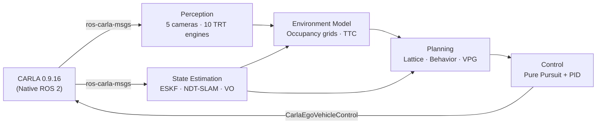
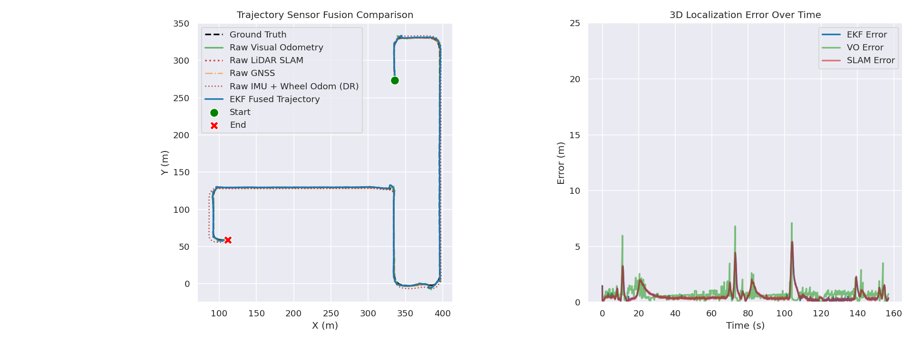
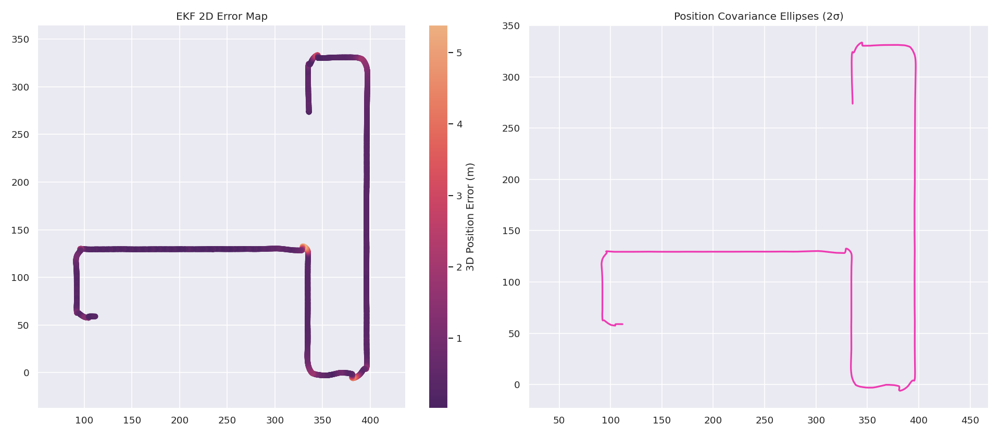

# Autonomous Driving Stack V6


-FF9900?logo=amazon-aws&logoColor=white)

A closed-loop, modular autonomous driving pipeline deployed in CARLA simulation. This stack integrates multi-camera TensorRT perception, PCL NDT-SLAM localization, Error-State Kalman Filter (ESKF) sensor fusion, Frenet-frame lattice planning, and Pure Pursuit/PID control across **10 domain-separated ROS 2 packages**.

**V6 Architecture Update:** This iteration entirely removes the Python-based CARLA bridge, migrating to a native, highly-performant ROS 2 DDS architecture utilizing `ros-carla-msgs` for direct simulator-to-stack communication.

> **Deployment Status:** Deployed and actively running closed-loop navigation in CARLA simulation.

> **Companion repositories:**
> [`Perception Pipeline V2`](https://github.com/Udit0034/perception-pipeline-v2) — standalone multi-camera TensorRT validation harness
> [`LiDAR Perception Pipeline`](https://github.com/Udit0034/lidar-perception-pipeline) — RangeNet++ + PointPillars LiDAR perception node

---

## Contents

* [Architecture](#architecture)
* [Package Structure](#package-structure)
* [Metrics](#metrics)
* [Repository Layout](#repository-layout)
* [Getting Started](#getting-started)
* [Offline Analysis](#offline-analysis)
* [Known Limitations](#known-limitations)
* [Future Work](#future-work)

---

## Architecture



**Perception** — 5-camera synchronized topology: StereoNet stereo depth, 4× monocular segmentation, YOLO detection, traffic-sign classifier. All engines run as a single batched TensorRT FP16 pass.

**State Estimation** — ESKF fusing IMU (100 Hz), GNSS (1 Hz), Visual Odometry, PCL NDT-SLAM, altimeter, and wheel odometry. Analytical Jacobians, Joseph-form covariance update for numerical stability.

**Environment Model** — LiDAR point-cloud occupancy grid, semantic BEV occupancy grid, lane-centering from segmentation masks, radar-vision TTC fusion for tracked objects.

**Planning** — Global mission planner over CARLA topology, Frenet-frame lattice trajectory optimization, behavioral state machine (speed limits, intersection logic), curvature-aware velocity profile generation.

**Control** — Pure Pursuit lateral controller + PID longitudinal controller closing the loop to CARLA actuation natively at 50 Hz, asynchronous from the perception cadence.

---

## Package Structure

The stack enforces a strict separation of concerns, splitting domains into dedicated ROS 2 packages. Deep learning inference and orchestration are handled in Python, while deterministic, latency-critical components (Control, Planning, SLAM) are written entirely in C++17.

### `autonomy_perception` (Python) & `autonomy_perception_cpp` (C++)

| Node | Lang | Responsibility |
| --- | --- | --- |
| `inference_node` | Python | Batched TensorRT FP16 inference across 5 cameras (depth, segmentation, YOLO) |
| `traffic_sign_node` / `doppler` | Python | Traffic state recognition and dynamic object tracking |
| `engine_builder_node` | Python | ONNX → TensorRT engine compilation with INT8 calibration support |
| `lidar_occupancy_grid_node` | C++ | Point-cloud voxelization → local obstacle occupancy grid |
| `semantic_occupancy_grid` | C++ | Segmented BEV projection → obstacle costmap |
| `semantic_lane_centering` | C++ | Cross-track lane offset from segmentation masks |
| `ttc_fusion_node` | C++ | Radar + vision + depth fusion → per-object Time-to-Collision |

### `autonomy_localization` (Launch/Config) & `autonomy_localization_cpp` (C++)

`autonomy_localization` holds sensor covariance matrices, NDT resolution, step-size parameters, and map paths used at runtime. Compute lives entirely in the C++ package.

| Node | Lang | Responsibility |
| --- | --- | --- |
| `ekf_node` | C++ | Error-State Kalman Filter — 6-DOF multi-sensor fusion |
| `ndt_slam_node` | C++ | PCL NDT scan-matching SLAM with persistent 3D map load/save |
| `visual_odometry_node` | C++ | GFTT/FAST feature-based visual odometry |

### `autonomy_planning` (Python) & `autonomy_planning_cpp` (C++)

| Node | Lang | Responsibility |
| --- | --- | --- |
| `mission_planner_node` | Python | Global topological route planning |
| `vpg_node` | Python | Curvature + obstacle-aware velocity profile generation |
| `lattice_planner_node` | C++ | Polynomial trajectory sampling in Frenet frame |
| `behavior_planner_node` | C++ | Behavioral state machine — speed limits, intersections, stops |

### `autonomy_control` (Launch/Config) & `autonomy_control_cpp` (C++)

| Node | Lang | Responsibility |
| --- | --- | --- |
| `carla_controller_node` | C++ | Pure Pursuit lateral + PID longitudinal → `CarlaEgoVehicleControl` at 50 Hz |

### `autonomy_evaluation` (Python)

| Node | Lang | Responsibility |
| --- | --- | --- |
| `evaluate_node` | Python | Real-time RMSE computation against CARLA ground truth; exports CSV logs to `eval_plots/` on clean shutdown |

---

## Metrics

All figures measured in closed-loop CARLA simulation on a single **AWS G4dn instance (NVIDIA T4)**, full stack running concurrently.

### Full-Stack Runtime

| Metric | Value | Notes |
| --- | --- | --- |
| Perception throughput | **~89 ms (~11 FPS)** | 5-camera TRT inference under full-stack co-located GPU load on T4 |
| Control loop rate | **50 Hz (20 ms)** | Pure Pursuit + PID running asynchronously, independent of perception cadence |
| Average closed-loop speed | **5.96 m/s (~21.5 km/h)** | Urban driving scenario |
| Validation run length | 157 s / 2,789 samples | Continuous closed-loop urban route, Town01 |

### State Estimation & Localization

Evaluated against CARLA simulator ground truth over a ~600 m / 7-turn closed-loop route:

| Metric | Value |
| --- | --- |
| Mean 3D position error | **0.615 m** |
| 3D position RMSE | **0.904 m** |
| X / Y / Z RMSE | 0.531 m / 0.722 m / 0.115 m |
| Yaw RMSE | **2.442°** |
| SLAM 3D RMSE | **0.907 m** |





### Perception (Trained TensorRT FP16 Engines)

| Model Head | Metric | Value |
| --- | --- | --- |
| Front stereo depth (StereoNet) | RMSE / Abs Rel (1–150 m) | 10.50 m / 0.114 |
| Side monocular depth | RMSE (1–60 m) | **0.78 m** |
| Rear monocular depth | RMSE | **1.49 m** |
| Side segmentation | mIoU | **0.702** |
| Front segmentation | mIoU | **0.586** |
| YOLO detection | mAP50 / mAP50-95 | **0.943 / 0.764** |
| Traffic sign classifier | Precision / Recall | **89.0% / 82.0%** |

Full per-range depth breakdowns and per-class detection tables are in the [Perception Pipeline V2](https://github.com/Udit0034/perception-pipeline-v2) repository.

---

## Repository Layout

```text
autonomous-driving-stack-v6/
├── eval_plots/                     # Offline analysis and trajectory evaluation plots
├── maps/                           # PCD maps for NDT-SLAM (hero_map.pcd)
├── requirements.txt
├── src/
│   ├── autonomy_stack/             # Master launch orchestrator and RViz configurations
│   ├── autonomy_perception/        # Python: TRT inference, dashboard, traffic logic
│   ├── autonomy_perception_cpp/    # C++: LiDAR/Semantic occupancy grids, lane-centering, TTC
│   ├── autonomy_localization/      # Launch & Configs: sensor covariances, NDT params, map paths
│   ├── autonomy_localization_cpp/  # C++: ESKF, NDT-SLAM, Visual Odometry
│   ├── autonomy_planning/          # Python: Mission planner, Velocity Profile Generation (VPG)
│   ├── autonomy_planning_cpp/      # C++: Frenet lattice planner, behavioral state machine
│   ├── autonomy_control/           # Launch & Configs for control
│   ├── autonomy_control_cpp/       # C++: Pure Pursuit + PID controllers
│   ├── autonomy_evaluation/        # Python: Real-time RMSE evaluation node
│   └── ros-carla-msgs/             # Native ROS 2 message definitions for CARLA
└── utils/                          # Offline analysis scripts (EKF, planning logs)
```

---

## Getting Started

### Prerequisites

| Dependency | Version |
| --- | --- |
| OS | Ubuntu 22.04 LTS |
| ROS 2 | Humble |
| CARLA | 0.9.16 (Native ROS 2 setup) |
| CUDA / TensorRT | 12.x / 8.x+ |
| PCL / OpenCV / Eigen3 | 1.12+ / 4.x / 3.4+ |

**Not included:** trained ONNX models, TensorRT engine cache, and the PCD map. Configure paths in `autonomy_stack/config/paths.yaml` before first run.

### 1. Workspace Setup

```bash
git clone https://github.com/Udit0034/autonomous-driving-stack-v6.git
cd autonomous-driving-stack-v6
python3 -m venv venv
source venv/bin/activate
pip install -r requirements.txt
```

### 2. Build

Run `colcon build` **outside** the Python venv to avoid ROS 2 build-chain conflicts.

```bash
deactivate
source /opt/ros/humble/setup.bash
rosdep install --from-paths src --ignore-src -r -y
colcon build --symlink-install --cmake-args -DCMAKE_BUILD_TYPE=Release
source install/setup.bash
```

### 3. Launch

```bash
# Compile TRT engines first (required once per engine cache miss)
source venv/bin/activate
ros2 run autonomy_perception engine_builder_node

# In a new terminal — source workspace + venv, then launch stack
source install/setup.bash && source venv/bin/activate
ros2 launch autonomy_stack main.launch.py with_rviz:=true
```

---

## Offline Analysis

`evaluate_node` exports CSV logs to `eval_plots/` on clean shutdown (`Ctrl+C`).

```bash
# EKF localization performance
python utils/analyze_ekf_performance.py \
  --gt eval_plots/tuning_data/gt_data.csv \
  --ekf eval_plots/tuning_data/ekf_data.csv
```

---

## Known Limitations

* **Single-GPU contention:** CARLA rendering and TRT engines share one T4 — perception throughput (~11 FPS) is lower than standalone figures; control runs asynchronously at 50 Hz and is unaffected.
* **VO scale drift:** Monocular visual odometry exhibits ~9.77% scale drift over extended open loops before fusion correction; currently mitigated by tightly coupled IMU/wheel-encoder fusion in the ESKF.
* **Static environment assumption:** Lattice and behavior planners currently handle fixed obstacle scenarios; dynamic multi-agent interaction is not yet modeled.

---

## Future Work

* **Dual-GPU deployment:** Split CARLA rendering and TensorRT inference across two instances; migrate to FP8 engines.
* **LiDAR fusion:** Integrate the [LiDAR Perception Pipeline](https://github.com/Udit0034/lidar-perception-pipeline) directly into the occupancy and localization layers for multi-modal scene understanding.
* **VLO integration:** Replace the current feature-based VO with the Visual-LiDAR Odometry pipeline currently under development — targeting sub-1% scale drift.
* **Dynamic interaction:** Extend lattice planners with multi-agent trajectory prediction for high-density pedestrian and vehicle interactions.

---

## License

MIT — see [LICENSE](LICENSE).
